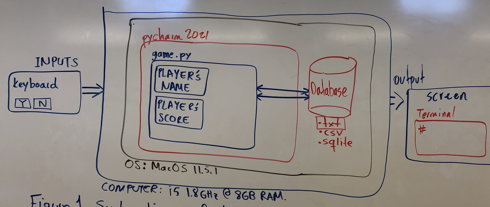

# Unit 1: A classic game 

# Criteria A: Planning

## Problem definition

The owner of the local game shop is an enthusiast of classic computer games. He has been looking for a talented programmer that can help him revive his passion for text-based games. He has few requirements for this task:

1. The game has to be entirely text-based.
2. The game must record the time played.
3. The game must record the player name and score.

Apart for this requirements, the owner is open to any type of game, topic or genre.

## Proposed Solution

Design statement:
I will to design and make a ———— for a client who is ———. The ——– will about ———— and is constructed using the software ———. It will take  ———- to make and will be evaluated according to the criteria ———.

Justify the tools/structure of your solution

## Success Criteria
1. The game has to be entirely text-based.
2. The game must record the time played.
3. The game must record the player name and score.
4.
5.
6.

# Criteria B: Design

## System Diagram

**Figure 1.** System diagram for the proposed solution

As shown in **Fig. 1**, the proposed solution runs on Python and it is developed using Pycharm (v. 2021). The proposed game...

## Flow Diagrams

## Record of Tasks
| Task No | Planned Action | Planned Outcome | Time estimate | Target completion date | Criterion |
|---------|----------------|-----------------|---------------|------------------------|-----------|
|   1     | Create system diagram | To have a clear idea of the hardware and software requirements for the proposed solution                 |  10min              |                  Sep 24      |   B |
|         |                |                 |               |                        |           |
|         |                |                 |               |                        |           |
