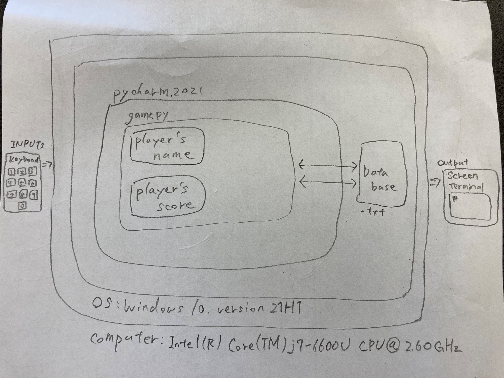

# Unit 1: A classic game 

# Criteria A: Planning

## Problem definition

The owner of the local game shop is an enthusiast of classic computer games. He has been looking for a talented programmer that can help him revive his passion for text-based games. He has few requirements for this task:

1. The game has to be entirely text-based.
2. The game must record the time played.
3. The game must record the player name and score.

Apart for this requirements, the owner is open to any type of game, topic or genre.

## Proposed Solution

I will to design and make a game for a client who is the owner of a local game shop who loves classic computer games. The game will be about text-based cards game and is constructed using the software Pyton on Pychart. It will take 3 weeks to make and will be evaluated according to the criteria shown below.

## Success Criteria

1. The game has to be entirely text-based.
2. The game must record the time played.
3. The game must record the player name and score.
4. The game actions must be instructed clearly. eg)"Select cards", "Choose an option".
5. The game must show clear description of the rules.
6. The game description and instruction must be in English.

# Criteria B: Design

## System Diagram

System diagram fro the proposed solution

As shown in the diagram, the player only needs keyboard to play this game.

## Flow Diagrams

## Record of Tasks
| Task No | Planned Action | Planned Outcome | Time estimate | Target completion date | Criterion |
|---------|----------------|-----------------|---------------|------------------------|-----------|
|    1    | Create system  |                 |               |                        |           |
|         | diagram        |                 |               |                        |           |
|         |                |                 |               |                        |           |
