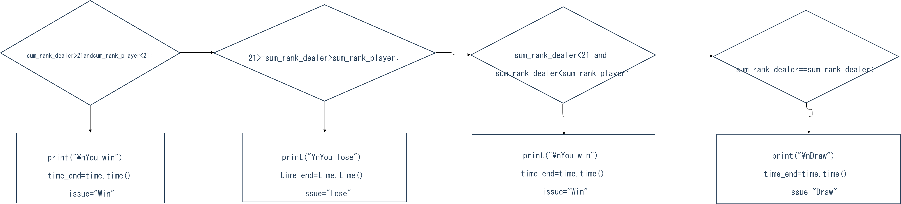

# Unit 1: A classic game 


# Criteria A: Planning

## Problem definition

The owner of the local game shop is an enthusiast of classic computer games. He has been looking for a talented programmer that can help him revive his passion for text-based games. He has few requirements for this task:

1. The game has to be entirely text-based.
2. The game must record the time played.
3. The game must record the player name and score.

Apart for this requirements, the owner is open to any type of game, topic or genre.

### Pre-exsisting product/issue

There are plenty of text-based Blackjack games on the Internet, but ones created on Python were rare. I found it problematic that many of them lacked description and instruction for the game, so that those games' user-friendliness was not satisfactory.

## Proposed Solution

### Design Statement

I will to design and make a game for a client who is the owner of a local game shop who loves classic computer games. The game will be about text-based cards game and is constructed using the software Pyton on Pychart. It will take 3 weeks to make and will be evaluated according to the criteria shown below. 

### System

The game is going to be developed on a programming editor named Pycharm on windows10 OS. I chose Pycharm for the software to develop this game because Pycharm is easy to use and pretty intuitive when implementing codings.

### Justification of the software selected

The programming language I selected for the text-based game development is python on Pycharm. The reason why I selected python for this game development is because it is easy to find hints on the Internet when I got stuck on a part of coding since python is one of the most popular computer language.

### Game Contents

It is a simple blackjack game. In regular blackjack games, the player is supposed to bet on the game, but for this one, in order to let the player enjoy the pure part of Blackjack. In the game, cards are shown in ascii illustration for the sake of visual usability. For those who are not familiar with Blackjack, as in the success criteria, players can optionally check a brief description of the rules. Also, score, time, and the name of player are stored in a local database in another file as requested.

## Success Criteria

1. The game has to be entirely text-based.
2. The game must record the time played.
3. The game must record the player name and score.
4. The game actions must be instructed clearly. eg)"Select cards", "Choose an option".
5. The game must show clear description of the rules.
6. The game description and instruction must be in English.

# Criteria B: Design

## System Diagram

Figure_1. System diagram fro the proposed solution

As shown in the diagram, the player only needs keyboard to play this game.

## Flow Diagrams

### A flow diagram to print cards in ascii illustration


### A flow diagram to let the player to collect cards


### A flow diagram to show if the player won or lost



## Record of Tasks

| Task No | Planned Action                                                                | Planned Outcome                                                                    | Time Estimate | Target Conpletion Date | Critetion |
|---------|-------------------------------------------------------------------------------|------------------------------------------------------------------------------------|---------------|------------------------|-----------|
| 1       | Create system diagram                                                         | To have a clear idea of the hardware and software requirements for the proposition | 10 min        | Sep 30th               | B         |
| 2       | Create an encryption function for the user data                               | A function tested that uses the caesar cypher                                      | 20 min        | Oct 10th               | C         |
| 3       | Integrate the encryption with the database save/load function                 | The database is encrypted and can be read/writen                                   | 15 min        | Oct 10th               | C         |
| 4       | Create a random card system                                                   | To have a system for providing cards to the player                                 | 15 min        | Oct 10th               | C         |
| 5       | Create a system for showing cards in ascii illustration                       | The player can see his/her cards in ascii illustration                             | 45 min        | Oct 10th               | C         |
| 6       | Print cards for the dealer and the player                                     | The player can see his/her and the dealer's cards                                  | 15 min        | Oct 10th               | C         |
| 7       | Create a system for the player to choose "hit" or "stand" and show the result | The player can see their cards and choose to pick one more card or drop            | 40 min        | Oct 10th               | C         |
| 8       | Create an automatic system to show dealer's cards                             | Show the dealer's cards                                                            | 60 min        | Oct 10th               | C         |
| 9       | Coding to judge and show if the player won or lost                            | Show the issue                                                                     | 15 min        | Oct 15th               | C         |
| 10      | Show the score, time, player's name                                           | Show the score,time, player's name                                                 | 10 min        | Oct 15th               | C         |
| 11      | Encode the data into Caesar cypher                                            | Make the data (player's score, name, time and the issue) into cyper                | 15 min        | Oct 15th               | C         |
| 12      | Save the data in  another local file                                          | Save the data in another local file                                                | 10 min        | Oct 15th               | C         |
| 13      | Write description of the rules                                                | Show Blackjack's rules                                                             | 90 min        | Oct 15th               | C         |
| 14      | Set some quick breaks in the coding                                           | In order to let the player to have time to see the information                     | 20 min        | Oct 15th               | C         |
| 15      |                                                                               |                                                                                    |               |                        |           |

## Evaluation

### Test plan

| Description                                                              | Type                      | Input                                                                                                                                 | Expected Output                                                                                                                                                             |
|--------------------------------------------------------------------------|---------------------------|---------------------------------------------------------------------------------------------------------------------------------------|-----------------------------------------------------------------------------------------------------------------------------------------------------------------------------|
| Testing if the player's cards and the dealer's cards are shown properly. | Unit Testing (Function)   | N/A (Auto) (black_jack_2.py)                                                                                                          | ┌────┐ │Q       │ │        │ │        │ │   ♠    │ │        │ │        │ │       Q│x2 └────┘             with a random rank of card             from A to K and random suit |
| Testing if description of Blackjack is shown when type "y"               | Unit Testing (Function)   | N/A (Auto) (black_jack_2.py)                                                                                                          | Description is shown                                                                                                                                                        |
| Testing if the game works properly.                                      | Integration (Function)    | 1. Player's name 2. "n" 3. Type "y" until the score reaches 17 (If it goes over 21, repeat 1-3) 4. Type "n" when the score reaches 17 | No bugs and typos                                                                                                                                                           |
| Review if code is easy for other  programmers to understand              | Code Review (Non-Funtion) | N/A (black_jack_2.py)                                                                                                                 | Simple and clear code                                                                                                                                                       |

# Criteria C: Coding

```.py
# importing random module
import random
import time

print("\n\n\nWelcome to 'Text-based Blackjack game'")
player_name = str(input("\n\nPlease enter your name: "))

opt = str(input("\n\nWould you like to see the rules of Blackjack? if yes, type 'y'. If no, type 'n'. : "))

if opt == "y":
    print("\n\n\nBlackjack, also known as Twenty-one, is a simple card game. The game requires 52-pack cards and Jokers"
          " are not used for this game. "
          "\n\nOBJECT OF THE GAME"
          "\nThe player attempts to beat the dealer by getting a count as close to 21 as possible, without going"
          " over 21."
          "\n\nCARD VALUES"
          "\nIt is up to the player if an ace is worth 1 or 11. Face cards are 10 and any other card is "
          "its pip value."
          "\n\nTHE DEAL"
          "\nWhen the game begins, the player is given two cards face up to him/her. The dealer gets one card face up "
          "and one card face down."
          "\n\nTHE PLAY"
          "\nThe player can decide whether to 'stand' (not ask for another card) or 'hit' (ask for another "
          "card in an attempt to get closer to a count of 21, or even hit 21 exactly).\n The player can continue this "
          "until deciding to stand on the total (if it is 21 or under), or goes 'bust' (if it is over 21). In the "
          "latter case, the player loses."
          "\n\nTHE DEALER'S PLAY"
          "\nWhen the player's turn is over, the dealers face-down card is turned up. If the total of the cared ranks "
          "is 17 or more, it must stand. If the total is 16 or under, the \ndealer must take a card. The dealer must "
          "continue to take cards until the total is 17 or more, at which point the dealer must stand.The dealer's "
          "decisions are all automatic."
          "\n\nTHE ISSUE"
          "\nWhen the dealer's turn is over, if the dealer's total score is not over 21 and closer to 21 than the "
          "player's, the player loses. Otherwise, the player wins. When the \nplayer's score and the dealer's score is "
          "even, the player loses. Also, when both of them bust or make blackjack, the player loses.")
    input("\n\n\nPress enter to start a game...")

# listing all the suits and ranks of cards
cards_rank = ["A", "2", "3", "4", "5", "6", "7", "8", "9", "10", "J", "Q", "K"]
cards_suit = ["♠", "♥", "♣", "♦"]

# allocating random cards to the player and the dealer
dealer1 = random.choice(cards_rank) + random.choice(cards_suit)
dealer2 = random.choice(cards_rank) + random.choice(cards_suit)
player1 = random.choice(cards_rank) + random.choice(cards_suit)
player2 = random.choice(cards_rank) + random.choice(cards_suit)

# ascii illustration of cards
hiddencard = """
┌─────────┐
│░░░░░░░░░│
│░░░░░░░░░│
│░░░░░░░░░│
│░░░░░░░░░│
│░░░░░░░░░│
│░░░░░░░░░│
│░░░░░░░░░│
└─────────┘
"""
opencard = """
┌─────────┐
│{}     {}│
│         │
│         │
│    {} {}│
│         │
│         │
│     {}{}│
└─────────┘
"""
# Count the time
time_sta = time.time()
# Straightening the line of the right side of ascii card
print(f"\n\n\nYour cards")
time.sleep(1)
if player1[0] == "10" and player2[0] == "10":
    print(opencard.format(player1[0], "  ", player1[1], "   ", "  ", player1[0]),
          opencard.format(player2[0], "  ", player2[1], "   ", "  ", player2[0]))
elif player1[0] == "10" and player2[0] != "10":
    print(opencard.format(player1[0], "  ", player1[1], "   ", "   ", player1[0]),
          opencard.format(player2[0], "   ", player2[1], "   ", "   ", player2[0]))
elif player1[0] != "10" and player2[0] == "10":
    print(opencard.format(player1[0], "   ", player1[1], "   ", "  ", player1[0]),
          opencard.format(player2[0], "  ", player2[1], "   ", "  ", player2[0]))
else:
    print(opencard.format(player1[0], "   ", player1[1], "   ", "   ", player1[0]),
          opencard.format(player2[0], "   ", player2[1], "   ", "   ", player2[0]))

# Straightening the line of the right side of ascii card
time.sleep(2)
print(f"Dealer's cards")
time.sleep(1)
if dealer1[0] == "10":
    print(opencard.format(dealer1[0], "  ", dealer1[1], "   ", "  ", dealer1[0]))
    print(hiddencard)
else:
    print(opencard.format(dealer1[0], "   ", dealer1[1], "   ", "   ", dealer1[0]))
    print(hiddencard)

sum_rank_player = 0
# inputting the ranks of the cards
if player1[0] == "J" or player1[0] == "Q" or player1[0] == "K":
    sum_rank_player += 10
elif player1[0] == "A":
    sum_rank_player += 11
else:
    sum_rank_player += int(player1[0])

if player2[0] == "J" or player2[0] == "Q" or player2[0] == "K":
    sum_rank_player += 10
elif player2[0] == "A" and sum_rank_player == 11:
    sum_rank_player += 1
elif player2[0] == "A" and sum_rank_player <= 10:
    sum_rank_player += 11
else:
    sum_rank_player += int(player2[0])

time.sleep(1.5)
print("\nYour score is ", sum_rank_player)

# player's turn
while sum_rank_player < 21:
    time.sleep(1.5)
    option = input("\n\nIf you want to hit, type 'y'. If you want to stand, type 'n': ")
    if option == "y":
        player_rank = random.choice(cards_rank)
        player_suit = random.choice(cards_suit)
        if player_rank == "J" or player_rank == "Q" or player_rank == "K":
            sum_rank_player += 10
            print(opencard.format(player_rank, "   ", player_suit, "   ", "   ", player_rank))
            time.sleep(1)
            print("\n\nYour score is ", sum_rank_player)
        elif player_rank == "A" and sum_rank_player >= 11:
            sum_rank_player += 1
            print(opencard.format(player_rank, "   ", player_suit, "   ", "   ", player_rank))
            time.sleep(1)
            print("\n\nYour score is ", sum_rank_player)
        elif player_rank == "A" and sum_rank_player < 11:
            sum_rank_player += 11
            print(opencard.format(player_rank, "   ", player_suit, "   ", "   ", player_rank))
            time.sleep(1)
            print("\n\nYour score is ", sum_rank_player)
        elif player_rank == "10":
            sum_rank_player += 10
            print(opencard.format(player_rank, "  ", player_suit, "   ", "  ", player_rank))
            time.sleep(1)
            print("\n\nYour score is ", sum_rank_player)
        else:
            sum_rank_player += int(player_rank)
            print(opencard.format(player_rank, "   ", player_suit, "   ", "   ", player_rank))
            time.sleep(1)
            print("\n\nYour score is ", sum_rank_player)
    else:
        break

time.sleep(1.5)
# Intermediate results
if sum_rank_player > 21:
    print("\nBust")
    time.sleep(1)
    print("\nYou lose")
    time_end = time.time()
    issue = "Lose"
else:
    print("\n\nYour score is ", sum_rank_player)
    time.sleep(1.8)

    print("\n\n\nDealer's turn")
    time.sleep(1.5)

    print("\n\nThe faced-down card is flipped over")
    time.sleep(2)

    if dealer2[0] == "10":
        print(opencard.format(dealer2[0], "  ", dealer2[1], "   ", "  ", dealer2[0]))
    else:
        print(opencard.format(dealer2[0], "   ", dealer2[1], "   ", "   ", dealer2[0]))
    time.sleep(1.5)
    print("The other card is ")

    if dealer1[0] == "10":
        print(opencard.format(dealer1[0], "  ", dealer1[1], "   ", "  ", dealer1[0]))
    else:
        print(opencard.format(dealer1[0], "   ", dealer1[1], "   ", "   ", dealer1[0]))
    sum_rank_dealer = 0

    # inputting the ranks of the cards
    if dealer1[0] == "J" or dealer1[0] == "Q" or dealer1[0] == "K":
        sum_rank_dealer += 10
    elif dealer1[0] == "A":
        sum_rank_dealer += 11
    else:
        sum_rank_dealer += int(dealer1[0])

    if dealer2[0] == "J" or dealer2[0] == "Q" or dealer2[0] == "K":
        sum_rank_dealer += 10
    elif dealer2[0] == "A" and sum_rank_dealer == 11:
        sum_rank_dealer += 1
    elif dealer2[0] == "A" and sum_rank_dealer <= 10:
        sum_rank_dealer += 11
    else:
        sum_rank_dealer += int(dealer2[0])

    print("\nDealer's score is ", sum_rank_dealer)
    time.sleep(1.5)

    while sum_rank_dealer <= 16:
        time.sleep(1.5)
        dealer_rank = random.choice(cards_rank)
        dealer_suit = random.choice(cards_suit)
        if dealer_rank == "J" or dealer_rank == "Q" or dealer_rank == "K":
            sum_rank_dealer += 10
            print(opencard.format(dealer_rank, "   ", dealer_suit, "   ", "   ", dealer_rank))
            time.sleep(1.5)
            print("\nDealer's score is ", sum_rank_dealer)
        elif dealer_rank == "A" and sum_rank_dealer >= 11:
            sum_rank_dealer += 1
            print(opencard.format(dealer_rank, "   ", dealer_suit, "   ", "   ", dealer_rank))
            time.sleep(1.5)
            print("\nDealer's score is ", sum_rank_dealer)
        elif dealer_rank == "A" and sum_rank_dealer < 11:
            sum_rank_dealer += 11
            print(opencard.format(dealer_rank, "   ", dealer_suit, "   ", "   ", dealer_rank))
            time.sleep(1.5)
            print("\nDealer's score is ", sum_rank_dealer)
        elif dealer_rank == "10":
            sum_rank_dealer += 10
            print(opencard.format(dealer_rank, "  ", dealer_suit, "   ", "  ", dealer_rank))
            time.sleep(1.5)
            print("\nDealer's score is ", sum_rank_dealer)
        else:
            sum_rank_dealer += int(dealer_rank)
            print(opencard.format(dealer_rank, "   ", dealer_suit, "   ", "   ", dealer_rank))
            time.sleep(1.5)
            print("\nDealer's score is ", sum_rank_dealer)
    time.sleep(1.5)
    if sum_rank_dealer > 21 and sum_rank_player < 21:
        print("\nYou win")
        time_end = time.time()
        issue = "Win"
    elif 21 >= sum_rank_dealer > sum_rank_player:
        print("\nYou lose")
        time_end = time.time()
        issue = "Lose"
    elif sum_rank_dealer < 21 and sum_rank_dealer < sum_rank_player:
        print("\nYou win")
        time_end = time.time()
        issue = "Win"
    elif sum_rank_dealer == sum_rank_dealer:
        print("\nDraw")
        time_end = time.time()
        issue = "Draw"

time.sleep(2)
print("\n\n" + "Name: ", player_name)
tim = time_end - time_sta
print("Time: ", str(round(tim)) + "s")
print("Score: ", sum_rank_player)


# encode the data of the players into caesar cypher
def caesar_cypher(shift: int, message: str):
    encoded_message = ''
    for i in range(len(message)):
        letter = message[i]
        letter_code = ord(letter)
        # if we "z" and shift=3, 122+3=125 =>'}'
        # but we need 'c' which is 99
        shifted_code = letter_code + shift
        if letter_code + shift > 122:
            # if we go beyond "z" we circle back to "a"
            shifted_code -= 26
        encoded_message += chr(shifted_code)
    return encoded_message


# Uploading the results to a file
with open("database.txt", "a") as files:
    data = f"{player_name}, {sum_rank_player}, {issue}, {round(tim)}\n"
    files.write(data)
```
